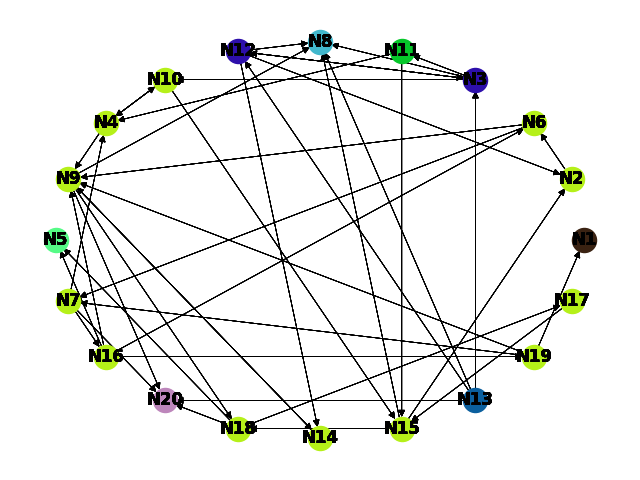
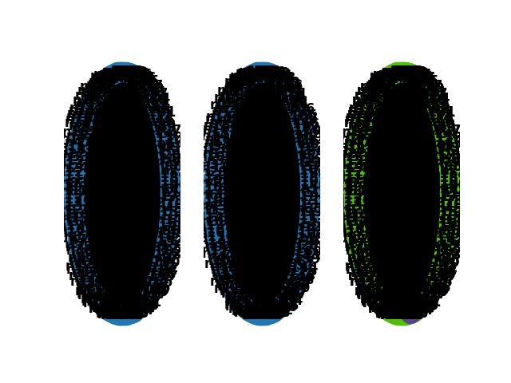
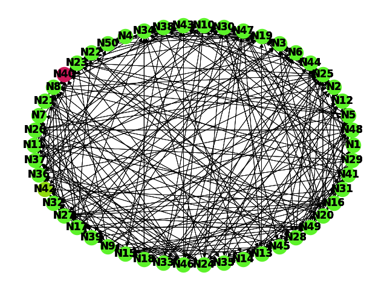

# NetworkComponentIdentifier

**Número da Lista**: 2
**Conteúdo da Disciplina**: Grafos 2

## Alunos
|Matrícula | Aluno |
| -- | -- |
| 16/0049733  |  Felipe Borges de Souza Chaves |
| 18/0055241  |  Victor Jorge da Silva Gonçalves |

## Sobre 

Esse projeto tem como objetivo demonstrar como funciona a análise de
componentes em um grafo, dessa forma ele gera um grafo aleatório e 
identifica de forma gráfica todos os componentes presentes no mesmo.

## Screenshots

Imagem gerada para 20 nós



Imagem gerada para 100 nós



Terminal listando componentes para um grafo com 50 nós



## Instalação 
**Linguagem**: python<br>
**Versão**: 3.8.6

Recomendamos o uso de uma virtualenv. Em caso de problema tente usar a versão especifica do python

1) Primeiro crie uma [virtualenv](https://docs.python.org/3/tutorial/venv.html), no exemplo abaixo 
o nome da virtualenv é **env**. Após isso entre no ambiente

```bash
virtualenv env
source env/bin/activate
```

2) Instale as dependências

```bash
pip3 install -r requirements.txt
```

3) Rode o projeto

```bash
python main.py
```

## Uso 

Para executar o projeto basta apenas usar o último comando citado na seção de instalação, 
isso irá gerar a imagem para um grafo com 20 nós. Se quiser testar um número customizado de 
nós envie o número como argumento, o exemplo abaixo mostra para 100 nós.

```bash
python main.py 1000
```

**OBS**: Usamos um número de nós entre 40 a 20 nós porque a  partir disto fica muito complicado 
da biblioteca gerar a imagem em um temó hábil. Além disso o consumo de memória para gerar a imagem
é gigantesco. Adiconei a variável *GENERATE_IMG* no arquivo constants.py caso queira testar com grafos 
muito grandes (acima de 50 nós) e não deseje gerar a imagem.

## Outros 

Qualquer problema em rodar o projeto por favor tente usar a versão especifica do python (3.8.6), 
em caso de problema abra uma issue detalhando ambiente, versao do python e log do **pip freeze**

