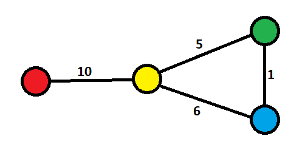
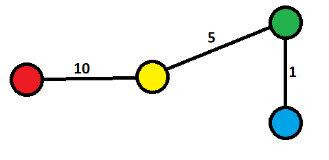
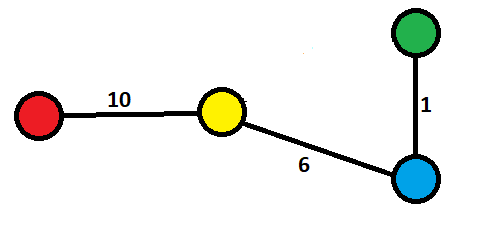

## Exercício 9

#### Letra (a)

Não. Toda árvore de gargalo mínimo não pode ser considerada uma árvore geradora mínima. Isso pode ser verificado através do seguinte contra-exemplo:

> **Grafo G**

> **Arvore geradora mínima de G**

> **Árvore de gargalo mínimo de G**

Ou seja, como a aresta de maior peso (10) é inevitável, todas as árvores geradoras possíveis são árvores de gargalo mínimo.

#### Letra (b)

Sim. Se assumirmos que a árvore geradora mínima não é uma árvore de gargalo mínimo, deverá existir dois ***cuts*** ***X*** e ***Y*** tal que a aresta escolhida para conectá-los não é a de menor peso, o que contradiz a propriedade do Cut.